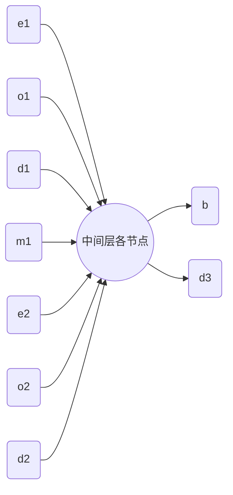

# Chaos Simulator python v1 设计

该版本将在之前Python和C++的各版本研究基础之上对程序进行**系统化、模块化的重构**。功能上将添加**意识对象**，用来植入一些星体，使它们成为**智能体**。

## 主要设计模块

下面是对每个模块实现功能的抽象描述，**不对具体实现进行计划**（具体实现规模较小）。

### physics

该模块定义**模拟环境、基本星体、意识体**（继承自基本形体）等物理模拟对象。该模块只提供静态的定义给其他库使用。

### evolution

定义进化的操作函数，供主程序调用。进化操作函数会调用**physics中的模拟环境**，来获得**适应度输出**。

### render

渲染界面。提供渲染初始化、帧渲染和渲染结束的接口。帧渲染调用函数作为参数，可供**physics**中的模拟器调用。

### main

主程序。调用以上所有模块。进化，可视化模拟。

## 智能体

### 智能体大脑构造

智能体的大脑暂使用双层神经网络（2轮有效计算）。

智能体可以**感知自身周围有威胁和无威胁的星体方位与质量。**每个星体只有有威胁和无威胁两种评估状态。

输入、输出都要格式化成为区间$[-1,1]$内的数，以便用$tanh$函数作为激活函数。

- 是否存在标志：统一为$false=0, true=1$
- 方向：$[-180°,180°]$格式化为$[-1,1]$
- 智能体到星体的距离：格式化为$[0,1]$，将有限空间中两点最大距离格式化为$1$（矩形区域：对角线长；圆形区域：直径长）

- 输入层
  
  - 最近的无威胁的星体
  
    - 是否存在$e_1$
  
    - 方向$o_1$
  
    - 距离$d_1$
  
    - 质量与本星体质量之比$m_1$
  
      这个数必然在$[0,1)$内
  
  - 最近的有威胁的星体
  
    - 是否存在$e_2$
    - 方向$o_2$
    - 距离$d_2$
  
- 输出层

  - 是否喷射子星$b$：在$[-1,1]$之间，$>0$表示喷射，$<=0$表示不喷射
  - 喷射子星的方向$d_3$（标准方向格式）

